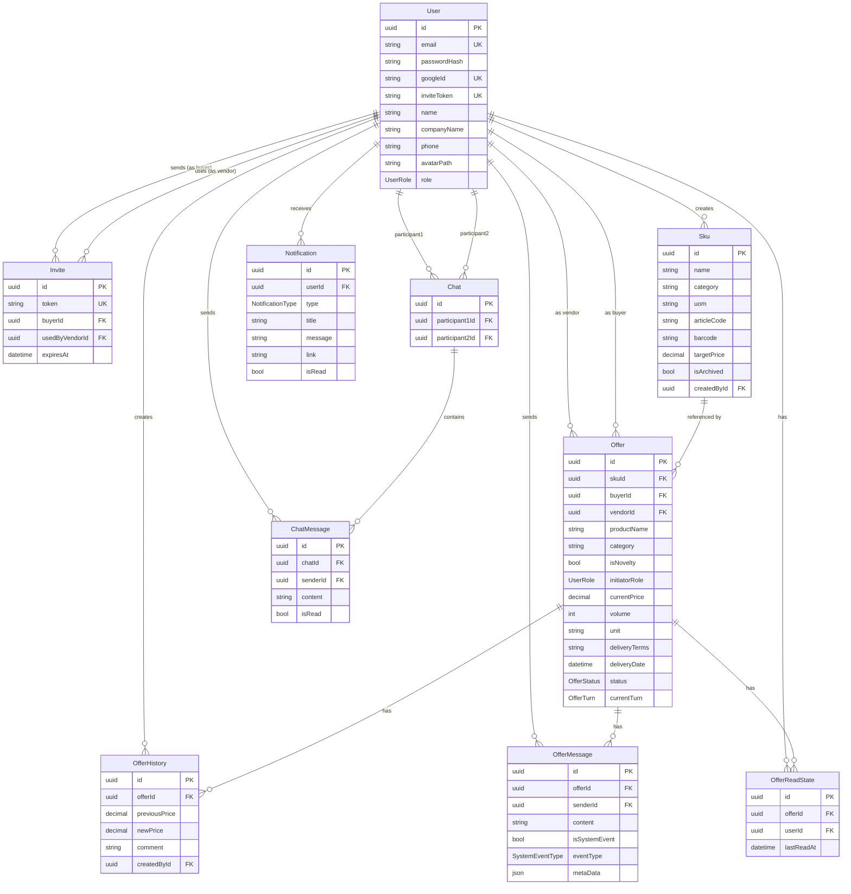
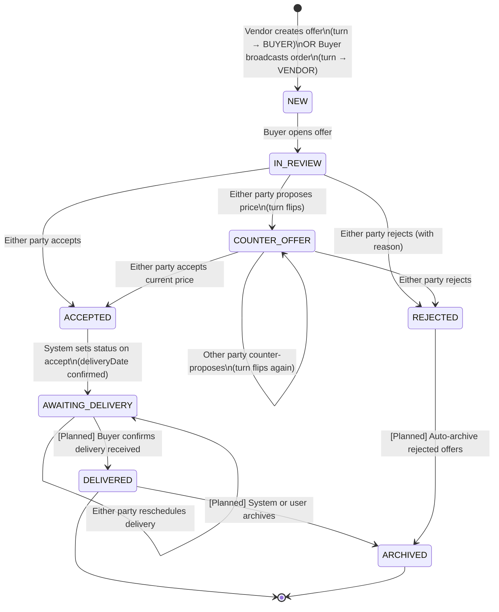

# PROJECT_MAP.md — RetailProcure

> **Primary context document for AI-assisted development.**
> Keep this file updated whenever the architecture, schema, or business logic changes.

---

## 1. Executive Summary

**RetailProcure** is a B2B procurement and negotiation platform that digitizes the relationship between **Buyers** (закупники — retail/procurement teams) and **Vendors** (постачальники — suppliers). The platform enables buyers to maintain a product catalog (SKU), send purchase requests to multiple vendors simultaneously, receive and negotiate offers, track deliveries, and communicate via real-time chat — all within a single integrated web application.

The current phase covers the full offer negotiation lifecycle (from creation through acceptance and delivery scheduling) along with direct messaging, in-app notifications, and a delivery calendar view. Active development is expanding **Order Management** to include `DELIVERED` and `ARCHIVED` statuses.

---

## 2. Tech Stack

| Layer | Technology | Version |
|---|---|---|
| **Frontend** | Next.js (App Router) | ^14 |
| **Frontend Language** | TypeScript | ^5 |
| **Frontend Styling** | Tailwind CSS | ^3.4 |
| **Frontend Icons** | Lucide React | ^0.441 |
| **Frontend HTTP** | Axios | ^1.7 |
| **Frontend Realtime** | Socket.IO Client | ^4.8 |
| **Frontend Toasts** | react-hot-toast | ^2.6 |
| **Frontend Calendar** | react-big-calendar | ^1.19 |
| **Frontend Date** | date-fns + `uk` locale | ^4.1 |
| **Backend** | NestJS | ^10 |
| **Backend Language** | TypeScript | ^5 |
| **Backend Auth** | Passport.js (JWT + Google OAuth 2.0) | — |
| **Backend Realtime** | Socket.IO (via `@nestjs/websockets`) | ^4.8 |
| **Backend Validation** | class-validator + class-transformer | ^0.14 / ^0.5 |
| **Backend File Upload** | Multer (via `@nestjs/platform-express`) | — |
| **Database** | PostgreSQL | ^15 |
| **ORM** | Prisma Client JS | ^6 |
| **Password Hashing** | bcrypt | ^5 |
| **API Docs** | Swagger (`@nestjs/swagger`) | — |

---

## 3. Core Architecture

### 3.1 Monorepo Layout

```
retail/
├── backend/               # NestJS REST API + WebSocket gateways
│   ├── prisma/
│   │   └── schema.prisma  # Single source of truth for the data model
│   └── src/
│       ├── main.ts        # Bootstrap: ValidationPipe, CORS, Swagger, static file serving
│       ├── app.module.ts  # Root module — imports all feature modules
│       ├── auth/          # JWT auth, Google OAuth, guards, strategies
│       ├── users/         # User profile management + avatar upload
│       ├── invites/       # Buyer→Vendor invite link system
│       ├── sku/           # Buyer product catalog (SKU)
│       ├── offers/        # Offer negotiation (core business logic)
│       ├── buyer-orders/  # Broadcast purchase orders to multiple vendors
│       ├── chats/         # Direct messaging between users
│       ├── notifications/ # Persistent in-app notifications
│       ├── realtime/      # Socket.IO gateways + realtime services
│       └── common/        # Shared decorators & validators
└── frontend/              # Next.js App Router SPA
    ├── app/               # File-system routing (pages + layouts)
    ├── components/        # Shared React components
    └── lib/               # Auth helpers, Axios client, TypeScript types, WS clients
```

### 3.2 Backend Module Structure

Each NestJS feature module follows the standard pattern:

```
<feature>/
├── <feature>.module.ts     # Imports, providers, exports
├── <feature>.service.ts    # Business logic + Prisma calls
├── <feature>.controller.ts # REST routes + guards + decorators
└── dto/                    # Validated request body shapes
```

### 3.3 Frontend Page Structure

```
app/
├── layout.tsx              # Root layout: NotificationsProvider, top-loader
├── template.tsx            # Page transition animations
├── page.tsx                # Public landing page
├── login/page.tsx
├── register/page.tsx
├── join/page.tsx           # Vendor invite-acceptance flow
├── auth/callback/page.tsx  # Google OAuth token exchange
├── dashboard/page.tsx      # Role-based navigation hub
├── profile/page.tsx        # User profile settings
├── buyer/
│   ├── page.tsx            # Buyer dashboard: orders + incoming offers
│   └── catalog/page.tsx    # SKU catalog CRUD
├── vendor/page.tsx         # Vendor dashboard: offers list + create offer
├── offers/[id]/
│   ├── page.tsx            # Negotiation room shell
│   ├── DealSidebar.tsx     # Offer terms, price, actions (accept/propose/reject)
│   └── DealChat.tsx        # Real-time negotiation chat
├── chats/
│   ├── page.tsx            # Chat list
│   └── [id]/page.tsx       # Chat dialog (real-time)
└── calendar/page.tsx       # Delivery calendar (react-big-calendar)
```

### 3.4 API Conventions

- **Base URL**: `http://localhost:3001/api`
- **Global prefix**: `/api`
- **Auth**: Bearer JWT in `Authorization` header
- **Validation**: Global `ValidationPipe` with `whitelist`, `forbidNonWhitelisted`, `transform`, `enableImplicitConversion`
- **Static files**: `uploads/` directory served at `/uploads`
- **Swagger**: `/openapi`
- **CORS**: Allowed origin `http://localhost:3000`

---

## 4. Data Model & Entities

### 4.1 Entity-Relationship Diagram



### 4.2 Enumerations

| Enum | Values | Description |
|---|---|---|
| `UserRole` | `BUYER`, `VENDOR` | Permanent role assigned at registration |
| `OfferStatus` | `NEW`, `IN_REVIEW`, `COUNTER_OFFER`, `ACCEPTED`, `REJECTED`, `AWAITING_DELIVERY` | Current negotiation/delivery state |
| `OfferTurn` | `BUYER`, `VENDOR` | Whose turn it is to act |
| `SystemEventType` | `PRICE_CHANGED`, `DEAL_ACCEPTED`, `TERMS_UPDATED`, `DELIVERY_RESCHEDULED` | Structured system event recorded in `OfferMessage` |
| `NotificationType` | `OFFER_MESSAGE`, `CHAT_MESSAGE`, `OFFER_UPDATE`, `SYSTEM` | In-app notification category |

### 4.3 Key Entity Descriptions

**`User`** — the central actor. Created as either `BUYER` or `VENDOR` at registration. Buyers can have a persistent `inviteToken` (reusable link) and are linked to vendors via the `Invite` table. Supports both password auth and Google OAuth (`googleId`).

**`Invite`** — a buyer-to-vendor connection record. Contains a `token` used in the `/join` page URL. `usedByVendorId` is populated when a vendor accepts the invite, creating the buyer↔vendor relationship.

**`Sku`** — a product catalog item owned by a buyer. Has a `targetPrice` (buyer's target price) and can be archived. Vendors can view SKUs of their connected buyers.

**`Offer`** — the central business entity representing one negotiation thread. Can reference a buyer's `Sku` or be a "novelty" product (`isNovelty: true`, `productName` filled in by vendor). The `currentTurn` field enforces whose move it is; `status` tracks lifecycle stage.

**`OfferHistory`** — an immutable log of price change events on an offer (previous price, new price, comment).

**`OfferMessage`** — a message in the negotiation thread. Can be a plain text message or a structured system event (`isSystemEvent: true`, `eventType` set, `metaData` contains event-specific data like old/new price).

**`OfferReadState`** — tracks when each user last read an offer's messages. Used to compute per-offer unread counts without scanning all messages.

**`Chat`** — a direct message channel between exactly two users. The pair `(participant1Id, participant2Id)` is unique (sorted alphabetically to avoid duplicates).

**`ChatMessage`** — a message in a `Chat`. Has an `isRead` flag for simple unread tracking.

**`Notification`** — a persisted in-app notification for one user. Linked to a `link` (usually an offer or chat URL) for navigation on click.

---

## 5. Business Logic & Flows

### 5.1 Offer Lifecycle State Machine



> **Note**: `DELIVERED` and `ARCHIVED` statuses are **planned** and under active development. They are not yet present in the Prisma schema.

### 5.2 Status Transition Rules

| From | To | Trigger | Actor |
|---|---|---|---|
| — | `NEW` | `POST /offers` (vendor-initiated) | VENDOR |
| — | `NEW` | `POST /buyer/orders` (buyer broadcast) | BUYER |
| `NEW` / `COUNTER_OFFER` | `COUNTER_OFFER` | `POST /offers/:id/propose` | Current turn holder |
| `NEW` / `COUNTER_OFFER` | `AWAITING_DELIVERY` | `POST /offers/:id/accept` | Either party |
| `NEW` / `COUNTER_OFFER` | `REJECTED` | `POST /offers/:id/reject` | Either party |
| `AWAITING_DELIVERY` | `AWAITING_DELIVERY` | `POST /offers/:id/reschedule` | Either party |
| `AWAITING_DELIVERY` | `DELIVERED` | _(planned)_ | BUYER |
| `DELIVERED` / `REJECTED` | `ARCHIVED` | _(planned)_ | System / User |

### 5.3 Turn-Based Negotiation Logic

The `currentTurn` field on `Offer` gates who can take actions:
- When a **vendor creates an offer**: `currentTurn = BUYER` (buyer must respond)
- When a **buyer creates a broadcast order**: `currentTurn = VENDOR` (vendor must respond)
- **Proposing a price** flips the turn to the other party
- **Accepting** or **rejecting** does not require turn validation
- The frontend only renders action buttons (Accept, Propose, Reject) when `currentTurn === user.role`

### 5.4 Buyer vs. Vendor Roles

| Dimension | Buyer (BUYER) | Vendor (VENDOR) |
|---|---|---|
| **SKU Catalog** | Full CRUD of own SKUs | Read-only access to linked buyers' SKUs |
| **Offer Creation** | Broadcasts purchase orders to multiple vendors at once | Creates targeted offers for specific SKUs or novelty products |
| **Invite System** | Generates invite links and shares with vendors | Uses invite link to connect to a buyer |
| **Data Access** | Sees all offers where they are the buyer | Sees all offers where they are the vendor |
| **Dashboard** | `/buyer` — incoming vendor offers + broadcast order form | `/vendor` — all offers + single-offer creation form |
| **Calendar** | Sees all accepted deliveries | Sees all accepted deliveries |

### 5.5 Vendor Invitation Flow

```
Buyer generates link (/invites/mine)
        ↓
Vendor visits /join?token=<token>
        ↓
Frontend validates token (GET /invites/validate/:token)
        ↓
Vendor registers (POST /auth/register with inviteToken)
OR Vendor logs in and accepts (POST /invites/accept with token)
        ↓
Invite record created: { buyerId, usedByVendorId }
        ↓
Vendor can now see buyer's SKUs & receive orders from buyer
```

### 5.6 Buyer Broadcast Order Flow

```
Buyer selects SKU + target price + volume + delivery date
Buyer selects 1-50 connected vendors
        ↓
POST /buyer/orders { skuId, targetPrice, volume, vendorIds[] }
        ↓
Single DB transaction: creates one Offer per vendorId
Each Offer: initiatorRole=BUYER, status=NEW, currentTurn=VENDOR
        ↓
WebSocket notification sent to each vendor in real-time
```

### 5.7 Real-Time Event Flow

```
[User Action] → [REST API] → [OffersService / ChatsService]
                                        ↓
                              [OffersRealtimeService]
                                        ↓
                    ┌───────────────────┴───────────────────┐
                    ↓                                       ↓
         emit to offer room                      emit to user room
         (offers:message:new)           (notification:offer_message /
                    ↓                    notification:offer_update)
         All clients in room                     ↓
         receive update              [NotificationsProvider]
                                     shows toast + updates bell count
                                     persists to DB via NotificationsService
```

---

## 6. Feature List

### Authentication & Identity
- Email + password registration and login
- Google OAuth 2.0 (via Passport.js `passport-google-oauth20`)
- JWT-based stateless session (stored in `localStorage`)
- Role-based access control via `@Roles()` decorator + `RolesGuard`
- Password change (requires current password)
- Avatar upload (Multer, ≤5MB, PNG/JPG/WebP)

### Invite & Connection System
- Buyer generates a persistent reusable invite link (`User.inviteToken`)
- Legacy single-use `Invite` records (backward compatible)
- `/join` page: validates token, supports both new registration and existing-user acceptance
- Google OAuth invite flow: `role`/`companyName`/`inviteToken` passed via base64-encoded `state` param
- Buyers see their connected vendors list; vendors see their connected buyers list

### Product Catalog (SKU)
- Buyer creates/edits/archives SKU items with name, category, UOM, article code, barcode, target price
- Vendor searches buyer's SKU catalog (used when creating an offer)
- Debounced SKU search via `ProductSelect` component (with 300ms debounce)
- "Novelty product" mode for vendors: propose a product not in the buyer's catalog

### Offer Negotiation
- Vendor-initiated or buyer-initiated (broadcast) offers
- Turn-based negotiation: price proposals flip `currentTurn`
- System event messages for all structural changes (price change, acceptance, rejection, rescheduling)
- Full price history per offer (`OfferHistory`)
- Offer filtering by status on dashboards
- Unread message count per offer (via `OfferReadState`)

### Direct Chat
- Buyer↔Vendor direct messaging channels
- Real-time via Socket.IO (`ChatsGateway`)
- Unread message count per chat
- Mark as read on open

### Notifications
- Persisted in-app notifications (last 50 shown)
- Real-time delivery via WebSocket to `user_{userId}` rooms
- Toast popups (`react-hot-toast`) with navigation link
- Bell icon with unread badge
- "Mark all as read" action

### Delivery Calendar
- `react-big-calendar` view showing `AWAITING_DELIVERY` offers by `deliveryDate`
- Month view by default, with Ukrainian locale (`date-fns` `uk`)

### Order Management _(active development)_
- Current: `AWAITING_DELIVERY` state with delivery date + rescheduling
- Planned: `DELIVERED` status (buyer confirms receipt) and `ARCHIVED` status (completed/dismissed offers)

---

## 7. Implementation Details

### Backend Patterns

**NestJS Module Pattern**
Every feature is a self-contained module (`*.module.ts`) that declares its controller and service. Cross-module dependencies are resolved via `imports` (e.g., `OffersModule` imports `PrismaModule` and `RealtimeModule`).

**Guards & Decorators**
- `JwtAuthGuard` wraps Passport's `AuthGuard('jwt')` and is applied per-controller or per-route
- `RolesGuard` reads `@Roles('BUYER' | 'VENDOR')` metadata and checks against the JWT `role` claim
- `@CurrentUser()` param decorator extracts `{ sub, email, role }` from the validated JWT payload
- `WsJwtGuard` validates JWT for WebSocket connections from `handshake.auth.token`

**Prisma Service**
`PrismaService` extends `PrismaClient` and implements `OnModuleInit`. It is provided globally and injected wherever database access is needed.

**File Upload**
Multer is used with `FileInterceptor`, storing files locally in `uploads/`. Files are served as static assets at `/uploads` via `useStaticAssets`.

**Validation**
All DTOs use `class-validator` decorators (`@IsString`, `@IsEmail`, `@IsEnum`, `@IsOptional`, etc.). The global `ValidationPipe` ensures non-whitelisted properties are stripped and rejected. Custom `@Match<T>(property)` validator enforces password confirmation fields.

**WebSocket Gateways**
Two gateways exist: `OffersGateway` and `ChatsGateway`. They share the same Socket.IO server via `@WebSocketServer()`. The corresponding realtime services (`OffersRealtimeService`, `ChatsRealtimeService`) hold a reference to the `Server` instance to emit events from non-gateway contexts (e.g., from REST controllers).

### Frontend Patterns

**Authentication**
Tokens and the user object are stored in `localStorage` using keys `retailprocure_token` and `retailprocure_user`. The `lib/auth.ts` module provides `getStoredToken()`, `getStoredUser()`, `setAuth()`, and `clearAuth()` helpers.

**API Client**
`lib/api-client.ts` exports `createApiClient()` and `getAuthApiClient()`. The latter creates an Axios instance pre-configured with `baseURL` and a `Bearer` token from `localStorage`. All authenticated API calls go through this factory.

**Global State (Notifications)**
`NotificationsProvider` is a React Context provider at the root layout. It connects to the Socket.IO server on mount (if authenticated), listens for notification events, shows toasts, and exposes `{ notifications, unreadCount, markAsRead, markAllAsRead }` to all children.

**Socket.IO Clients**
Three separate Socket.IO client modules exist in `lib/realtime/`:
- `offers-socket.ts` — per-offer-room connection for the negotiation page
- `chats-socket.ts` — per-chat-room connection for the chat page
- `notifications-socket.ts` — singleton connection for global notification delivery

**Next.js App Router**
All pages use React Server Component shells where possible, with `'use client'` boundaries for interactive sections. The `template.tsx` file provides CSS transition animations between page navigations. `nextjs-toploader` provides the top progress bar.

**Form Validation**
Forms use uncontrolled or controlled `useState` inputs with manual validation before submission. The `@Match` decorator pattern on the backend mirrors the frontend's "confirm password" checks.

---

## 8. API Reference Summary

### Auth (`/api/auth`)
| Method | Route | Auth | Description |
|---|---|---|---|
| `POST` | `/auth/register` | — | Register (buyer or vendor, optionally with inviteToken) |
| `POST` | `/auth/login` | — | Login → `{ accessToken, user }` |
| `GET` | `/auth/google` | — | Start Google OAuth |
| `GET` | `/auth/google/callback` | — | Google OAuth callback → redirect with `?token=` |

### Users (`/api/users`)
| Method | Route | Auth | Description |
|---|---|---|---|
| `GET` | `/users/me` | JWT | Get own profile |
| `PATCH` | `/users/me` | JWT | Update name/company/phone |
| `POST` | `/users/me/avatar` | JWT | Upload avatar image |
| `POST` | `/users/me/change-password` | JWT | Change password |

### Invites (`/api/invites`)
| Method | Route | Role | Description |
|---|---|---|---|
| `GET` | `/invites/mine` | BUYER | Get/create reusable invite link |
| `GET` | `/invites/validate/:token` | — | Validate token (public) |
| `POST` | `/invites/accept` | VENDOR | Accept invite by token |
| `GET` | `/invites/connections` | VENDOR | List connected buyers |
| `GET` | `/invites/vendor-connections` | BUYER | List connected vendors |

### SKUs (`/api/skus`)
| Method | Route | Role | Description |
|---|---|---|---|
| `GET` | `/skus` | BUYER, VENDOR | List SKUs |
| `GET` | `/skus/search?q=&buyerId=` | BUYER, VENDOR | Search SKUs |
| `POST` | `/skus` | BUYER | Create SKU |
| `PUT` | `/skus/:id` | BUYER | Update SKU |
| `PATCH` | `/skus/:id/archive` | BUYER | Archive SKU |

### Offers (`/api/offers`)
| Method | Route | Role | Description |
|---|---|---|---|
| `POST` | `/offers` | VENDOR | Create offer |
| `GET` | `/offers?status=` | BUYER, VENDOR | List offers |
| `GET` | `/offers/:id` | BUYER, VENDOR | Get offer detail |
| `PATCH` | `/offers/:id/counter` | BUYER, VENDOR | Counter-offer |
| `POST` | `/offers/:id/propose` | BUYER, VENDOR | Propose new price |
| `POST` | `/offers/:id/accept` | BUYER, VENDOR | Accept deal |
| `POST` | `/offers/:id/reject` | BUYER, VENDOR | Reject deal |
| `POST` | `/offers/:id/reschedule` | BUYER, VENDOR | Reschedule delivery |
| `POST` | `/offers/:id/read` | BUYER, VENDOR | Mark messages as read |
| `GET` | `/offers/unread-counts?ids=` | BUYER, VENDOR | Unread counts per offer |
| `GET` | `/offers/:id/messages` | BUYER, VENDOR | Get negotiation messages |
| `POST` | `/offers/:id/messages` | BUYER, VENDOR | Send message (HTTP fallback) |

### Buyer Orders (`/api/buyer/orders`)
| Method | Route | Role | Description |
|---|---|---|---|
| `POST` | `/buyer/orders` | BUYER | Broadcast order to multiple vendors |
| `GET` | `/buyer/orders` | BUYER | List buyer's orders |

### Chats (`/api/chats`)
| Method | Route | Auth | Description |
|---|---|---|---|
| `GET` | `/chats` | JWT | List chats with unread counts |
| `POST` | `/chats` | JWT | Create or get existing chat |
| `GET` | `/chats/:id` | JWT | Chat details + history |
| `POST` | `/chats/:id/messages` | JWT | Send message |
| `POST` | `/chats/:id/read` | JWT | Mark as read |

### Notifications (`/api/notifications`)
| Method | Route | Auth | Description |
|---|---|---|---|
| `GET` | `/notifications` | JWT | Get last 50 notifications |
| `GET` | `/notifications/unread-count` | JWT | Get unread count |
| `POST` | `/notifications/:id/read` | JWT | Mark one as read |
| `POST` | `/notifications/read-all` | JWT | Mark all as read |

### WebSocket Events
| Event (client → server) | Gateway | Description |
|---|---|---|
| `notifications:join` | Both | Join `user_{userId}` room for notifications |
| `offers:join` | OffersGateway | Join offer room, mark as read |
| `offers:message:send` | OffersGateway | Send message in offer thread |
| `chat:join` | ChatsGateway | Join chat room, mark messages as read |
| `chat:message:send` | ChatsGateway | Send chat message |

| Event (server → client) | Description |
|---|---|
| `offers:message:new` | New message in offer thread |
| `notification:offer_message` | Notification: new offer message |
| `notification:offer_update` | Notification: offer status changed |
| `chat:message:new` | New message in chat |
| `notification:chat_message` | Notification: new chat message |

---

## 9. Current Focus & Constraints

### Active Development: Order Management Expansion

The current sprint is expanding the `OfferStatus` lifecycle to cover post-acceptance stages:

| Status | State | Planned Trigger | Notes |
|---|---|---|---|
| `AWAITING_DELIVERY` | ✅ Implemented | `accept` endpoint | Delivery date set; rescheduling available |
| `DELIVERED` | 🚧 Planned | Buyer confirms receipt | Requires new endpoint + schema migration |
| `ARCHIVED` | 🚧 Planned | Manual or auto after delivery/rejection | Cleanup state; removes from active dashboards |

**Required changes** (when implementing):
1. Add `DELIVERED` and `ARCHIVED` to the `OfferStatus` enum in `schema.prisma` and run `prisma migrate`
2. Add `POST /offers/:id/deliver` endpoint (BUYER only, requires `AWAITING_DELIVERY`)
3. Add `POST /offers/:id/archive` endpoint (both roles, requires `DELIVERED` or `REJECTED`)
4. Update dashboard queries to exclude `ARCHIVED` offers by default
5. Update the calendar to show `DELIVERED` offers with a different style
6. Emit appropriate WebSocket events for status transitions
7. Update the `DealSidebar` to show the correct action buttons per new status

### Known Constraints
- **No server-side rendering for auth**: All protected pages rely on `localStorage` for token retrieval; SSR would require cookie-based auth or a BFF pattern
- **Local file storage**: Uploaded avatars are stored on disk (`uploads/`); no cloud storage (S3 etc.) is currently integrated
- **Single-region**: No multi-tenancy; all buyers and vendors share one database
- **No email delivery**: Invites are shared manually via copied links; no SMTP email sending is implemented
- **Turn enforcement is advisory**: The backend validates `currentTurn` on `propose` but not on `accept`/`reject`; the frontend hides buttons based on turn state

---

## 10. Development Setup

### Prerequisites
- Node.js ≥18, npm ≥9
- PostgreSQL running on port `5433` (or update `DATABASE_URL`)

### Docker compose

```bash
docker compose up -d
```

### Backend
```bash
cd backend
npm install
cp .env.example .env   # fill DATABASE_URL, JWT_SECRET, GOOGLE_CLIENT_*
npm run prisma:migrate
npm run start:dev       # http://localhost:3001
```

### Frontend
```bash
cd frontend
npm install
npm run dev             # http://localhost:3000
```

### Environment Variables (`backend/.env`)
| Variable | Default | Description |
|---|---|---|
| `DATABASE_URL` | — | PostgreSQL connection string |
| `JWT_SECRET` | — | JWT signing secret |
| `PORT` | `3001` | Backend port |
| `FRONTEND_URL` | `http://localhost:3000` | Used for CORS and OAuth redirect |
| `GOOGLE_CLIENT_ID` | — | Google OAuth app client ID |
| `GOOGLE_CLIENT_SECRET` | — | Google OAuth app client secret |
| `GOOGLE_CALLBACK_URL` | — | Google OAuth redirect URI |

### Frontend Environment Variables (`frontend/.env.local`)
| Variable | Default | Description |
|---|---|---|
| `NEXT_PUBLIC_API_URL` | `http://localhost:3001/api` | Backend API base URL |

---

*Last updated: March 2026*
